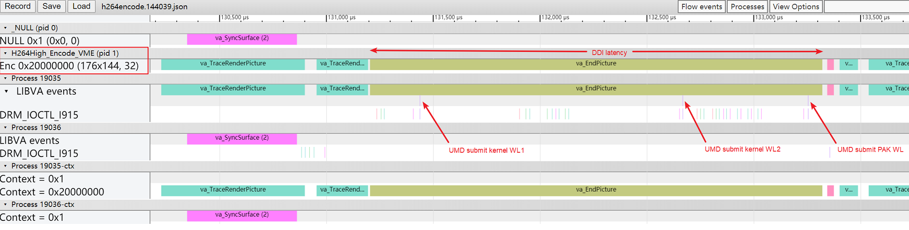

# libva-trace-visualizer

### apply libva patch
```
current libva trace has some issues to support this tool, need apply below libva patch before using it
https://gitlab.devtools.intel.com/gpu-va-solution/vavis/-/blob/master/libva-patch.diff
```

### how to use

```bash
python3 vis.py "application command line" trace_level
# trace_level (optional) = 1 (default), 2, 3
# 1: basic libva trace graph
# 2: basic libva trace graph + libva process+ctx graph
# 3: basic libva trace graph + libva process+ctx graph + strace graph
```

### example

```bash
python3 vis.py "mpeg2vldemo" 3
python3 vis.py "h264encode" 2
python3 vis.py "ffmpeg -loglevel verbose -hwaccel vaapi -i test.264 -f null -"
```



more examples in [cmd.md](https://github.com/mintaka33/libva-trace-visualizer/blob/master/cmd.md)
